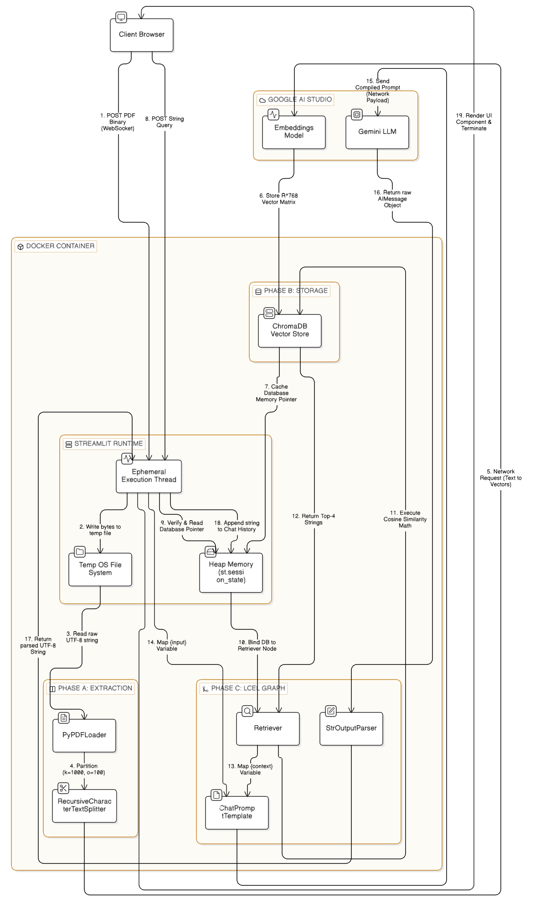

# Chat With PDF: Semantic Document Search Engine
Upload any PDF and ask the assistant about the content to get direct answers without ever searching throughout.

## Project Overview

This repository contains a fully decoupled, containerized Retrieval-Augmented Generation (RAG) application. The system allows users to upload binary PDF documents, projects the text data into a high-dimensional continuous vector space ($\mathbb{R}^{768}$), and utilizes Cosine Similarity mathematics to retrieve contextually relevant data. This retrieved context is then passed to a Large Language Model (LLM) to generate highly accurate, bounded responses.

The application strictly addresses the computational limitations of LLM architecture—specifically the $O(N^2)$ scaling of self-attention mechanisms—by ensuring only a mathematically relevant subset of data is passed into the model's context window.

---

### Technology Stack

| Component | Technology | Purpose |
| :--- | :--- | :--- |
| **Orchestration** | LangChain (LCEL) | Constructs the Directed Acyclic Graph (DAG) for data pipelining. |
| **Frontend/Server** | Streamlit | Manages the WebSocket connection, HTTP routing, and reactive UI execution. |
| **Vector Database** | ChromaDB | Executes spatial mathematical indexing and Cosine Similarity retrieval. |
| **Tensor Execution** | Google Gemini API | Handles embedding generation and the final transformer-based text generation. |
| **Containerization** | Docker & Compose | Enforces OS-level isolation and dependency management. |

---

## System Design and Architecture

The architecture is divided into an isolated Docker runtime environment and an external Tensor Execution network boundary. The system explicitly separates the stateless web server execution loop from persistent memory components to minimize redundant computation.

### 1. The Streamlit Runtime boundaries
Because Streamlit utilizes a stateless rerun paradigm (terminating the Python thread after every user interaction), the architecture defines specific memory boundaries:
*   **Ephemeral Execution Thread:** The short-lived CPU thread spawned per network request. It is destroyed upon completion, purging all local variables.
*   **Temp OS File System:** An I/O bridge required to write raw binary payloads from the WebSocket stream to the physical container disk for parsing.
*   **Heap Memory (`st.session_state`):** A persistent Hash Map. It stores the memory pointer for the Vector Database to protect it from the Python Garbage Collector across thread executions.

### 2. Execution Workflows

The system operates in two distinct computational cycles, as mapped in the architecture diagram:

**Workflow 1: Memory Allocation & Embedding (Steps 1-7)**
1. The client POSTs a PDF binary payload via WebSocket.
2. The Ephemeral Execution Thread writes these bytes to an OS-level temporary file.
3. **Phase A (Extraction):** `PyPDFLoader` reads the raw UTF-8 string, and `RecursiveCharacterTextSplitter` partitions the data using a sliding window algorithm (`chunk=1000, chunk_overlap=100`) to prevent semantic fragmentation.
4. **Phase B (Storage):** The partitioned strings are sent over the network to the Google Embeddings Model, which returns an $\mathbb{R}^{768}$ vector matrix. This matrix is stored locally via ChromaDB.
5. The execution thread caches the ChromaDB memory pointer directly into the persistent Heap Memory and terminates.

**Workflow 2: Retrieval & Generation (Steps 8-19)**
1. The client POSTs a string query.
2. A new Ephemeral Execution Thread is spawned. It queries the Heap Memory and retrieves the database pointer, completely bypassing Phase A and Phase B.
3. **Phase C (LCEL Graph):** The thread initializes the LangChain Expression Language pipeline.
4. The Retriever node executes Cosine Similarity math against the Vector Store, returning the top 4 strings closest to `1.0`.
5. `ChatPromptTemplate` compiles the retrieved context and the user's input into a strict API payload.
6. The payload is passed to the Gemini LLM for processing.
7. `StrOutputParser` strips the metadata from the raw `AIMessage` object, and the execution thread pushes the final UTF-8 string to the client browser before terminating.

#### System Architecture


---

## Local Deployment & Execution

This application is entirely hardware-agnostic and relies on Docker for execution. Follow these instructions to deploy the system on your local machine.

### Prerequisites
*   Docker Engine and Docker Compose installed.
*   Git installed.
*   A valid Google AI Studio API Key.

### 1. Clone the Repository
Open your terminal and pull the codebase:
```bash
git clone <your-repository-url>
cd <repository-directory>
```

### 2. Environment Configuration
The application relies on OS-level environment variable injection to secure API credentials. You must create a hidden environment file.

Create a file named `.env` in the root directory:
```bash
touch .env
```
Add your API key to the file exactly as follows (no quotes or spaces):
```text
GOOGLE_API_KEY=your_actual_api_key_here
GEMINI_API_KEY=your_actual_api_key_here
```

### 3. Build the Image and Boot the Container
Instruct the Docker daemon to read the `Dockerfile`, download the Python dependencies, build the image layer cache, and boot the web server in detached mode.

```bash
docker compose up --build -d
```

### 4. Access the Application
Once the container is running, Streamlit will bind to your local port `8501`. 
Open a web browser and navigate to:
```text
http://localhost:8501
```

### 5. Delete the containers
To halt the execution threads, shut down the server, and safely destroy the isolated container environment, run:
```bash
docker compose down
```